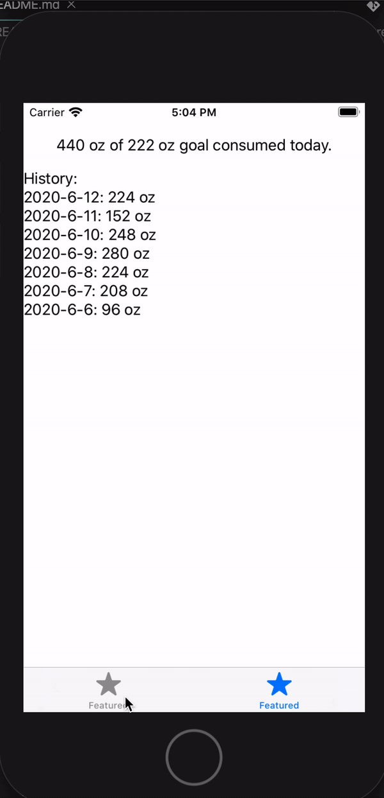

# HealthInterviewTakeHomeProblem

## Provided (in this repository):
* Two tabs: Track | Visualize
* Track: Add Water Button (Bar button item), Add Goal Button
* Visualize: Placeholder box for visualization, Text Field “X oz /X oz goal consumed”

## Minimum Submission Required:
* Track today’s water intake
* Display the total for the day
* Write a Readme:
	* What enhancement did you pick and why?
	* Any other details you wish to share? (Testing details + SDK)

## Screenshots

## What enhancement did you pick and why?
I chose "In Visualize tab, show a history of water intake on a day-to-day basis." because this task is more model layer focus. It also shows how flexible Data layer is. I took denormalization approach given the history can potentially expand to huge dataset depending on the duration.

## Any other details you wish to share? 
I used Xcode Version 11.5 for this project.

It follows standard MVVM as much as it can without using FRP library. `VisualizeWaterIntakeViewModel` and `VisualizeWaterIntakeViewController` are good representation of this architecture.

Some unit tests are added for the model layer to confirm the data is provided as expected. Additionally, method to generate dummy data, `saveMultipleRandomIntakesWithinAWeek` is added in `HealthWaterLogDataController` to test history feature manually.

At the end, I ended up spend about 5 hours. However, there is a lot of enhancement I can make:

* Make UI pretty.
* Show more than 7 days in history
* Separate `HealthWaterLogDataController` into entity base classes
* Use async method and callback functions for fetching entitites from CoreData
* Remove `CoreDataManager` and make the DataController a service.
* Make listner for the data layer entity specific.

## Reference:
* [github/gitignore](https://github.com/github/gitignore)
* [Core Data Best Practices](https://riptutorial.com/ios/example/27354/mvvm-without-reactive-programming)
* [MVVM Without Reactive Programming](https://riptutorial.com/ios/example/27354/mvvm-without-reactive-programming)
