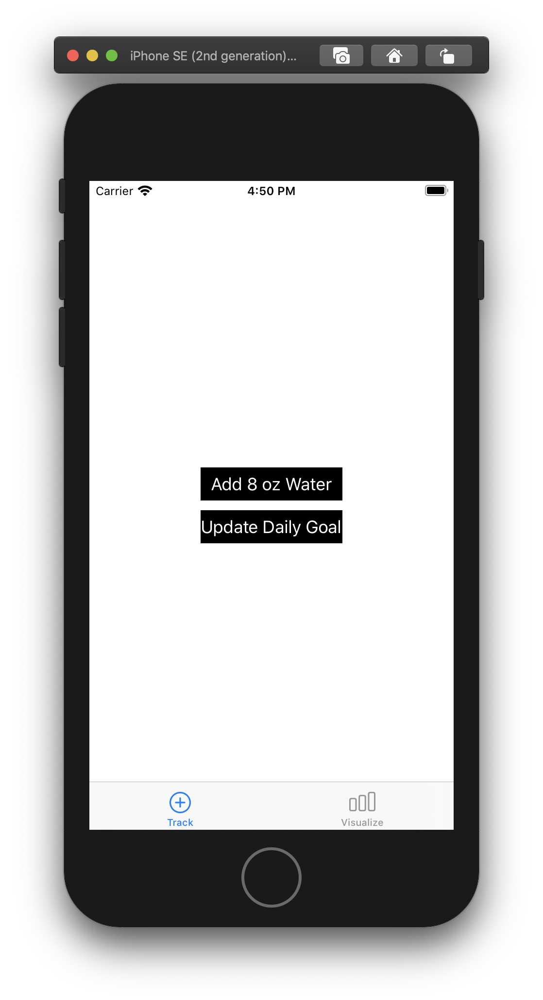
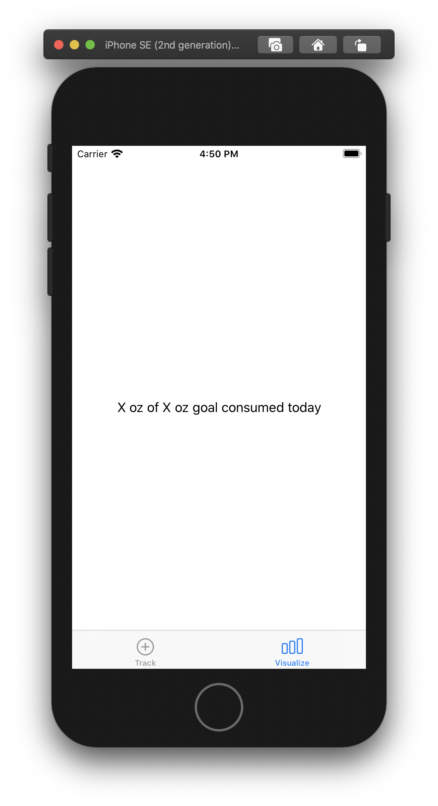

# HealthInterviewTakeHomeProblem
## Provided (in this repository):
* Two tabs: Track | Visualize
* Track: Add Water Button (Bar button item), Add Goal Button
* Visualize: Placeholder box for visualization, Text Field “X oz /X oz goal consumed”

### Two Tabs:

## Minimum Submission Required:
* Track today’s water intake
* Display the total for the day
* Write a Readme:
	* What enhancement did you pick and why?
	* Any other details you wish to share? (Testing details + SDK)

## Pick 1 Enhancement:
* Add a water intake goal and visualize progress
* Calculate water intake goal based on user’s weight (read from HealthKit). This goal and progress should update when user’s weight updates. 
* In Visualize tab, show a history of water intake on a day-to-day basis. 
* Replace water logging with the ability to log drinks that have a certain % water. Use CoreData to model these beverages and keep track of water intake per day. No need to update visualization tab. 
    * For example, if we assume coffee is 98% water, logging 100 ml of coffee would result in 98 ml of water consumed. For this enhancement we can estimate that tea is 100% water, coffee is 98%, and juice is about 85%.
* Integrate with UserNotifications to remind a user to log water intake when they haven’t met their goal.

